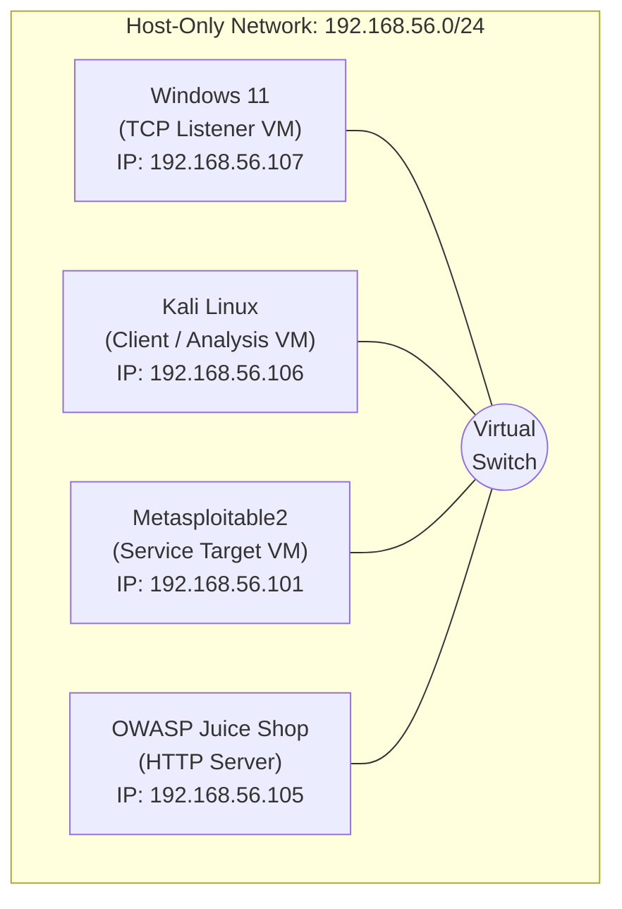

# Netcat (nc) Networking Lab – A Practical Guide to TCP Communication, Service Enumeration, and Network Troubleshooting

> A hands-on networking laboratory demonstrating the practical use of **Netcat (nc)** for TCP communication, file transfer, port scanning, banner grabbing, HTTP protocol testing, and network troubleshooting in a virtualized lab environment.


---

# Project Overview

Netcat (commonly known as **nc**) is one of the most versatile networking utilities available for Linux and Unix-like operating systems. Due to its flexibility in creating, reading, and writing TCP and UDP connections, it is widely recognized as the **"Swiss Army Knife of Networking."**

This project demonstrates the practical use of Netcat in a controlled virtual laboratory environment to understand how TCP communication works at the socket level. Rather than focusing on offensive techniques, the project emphasizes networking fundamentals, service verification, protocol analysis, and troubleshooting skills that are directly applicable to **Security Operations Center (SOC)**, **Blue Team**, **Network Administration**, and **IT Support** roles.

The laboratory exercises cover the complete workflow of establishing TCP connections, transferring files, verifying service availability, identifying network services through banner grabbing, manually interacting with HTTP servers, and troubleshooting connectivity issues using Netcat.

Each phase includes:

- Objective
- Theory
- Commands Executed
- Expected Output
- Actual Output
- Technical Explanation
- Troubleshooting Notes
- Screenshots
- Key Takeaways

---

# Objectives

The primary objectives of this project are to:

- Understand TCP client-server communication.
- Learn how Netcat creates TCP and UDP connections.
- Demonstrate manual file transfer over TCP.
- Perform service verification using Zero-I/O port scanning.
- Identify network services through banner grabbing.
- Manually construct and analyze HTTP requests.
- Develop practical troubleshooting techniques for common network connectivity issues.
- Document each exercise in a professional and reproducible manner suitable for technical portfolios.

---

# Skills Demonstrated

This project demonstrates practical experience with:

- TCP Socket Communication
- Client-Server Architecture
- File Transfer over TCP
- Zero-I/O Port Scanning
- Banner Grabbing
- Service Enumeration
- HTTP Request Construction
- HTTP Response Analysis
- Network Troubleshooting
- Connectivity Verification
- Basic Protocol Analysis
- Technical Documentation
- GitHub Project Documentation

---
## Table of Contents

- [Project Overview](#project-overview)
- [Objectives](#objectives)
- [Skills Demonstrated](#skills-demonstrated)
- [Lab Environment](#lab-environment)
- [Network Topology](#network-topology)
- [Repository Structure](#repository-structure)
- [Project Phases](#project-phases)
- [Screenshots](#screenshots)
- [Getting Started](#getting-started)
- [Learning Outcomes](#learning-outcomes)
- [References](#references)

---

# Lab Environment

The laboratory was built using a virtualized environment to simulate real-world network communication between multiple systems. Each virtual machine was assigned a specific role to demonstrate practical networking concepts using Netcat.

| Component | Version / Platform | Purpose |
|------------|--------------------|---------|
| Host Operating System | Kali Linux  | Runs Oracle VirtualBox and hosts all virtual machines |
| Oracle VirtualBox | 7.2.12r174389 | Virtualization platform |
| Kali Linux VM | Kali Linux 2026.3 | Primary attacker/client machine used for executing Netcat commands |
| Windows 11 VM | Windows 11 | Listener (server) and client for TCP communication |
| Metasploitable2 | Ubuntu-based Vulnerable VM | Target machine for banner grabbing and service enumeration |
| OWASP Juice Shop | Ubuntu 24.04 | HTTP server used for manual HTTP request testing |
| Netcat | OpenBSD Netcat / Ncat | Networking utility used throughout the project |

---

# Network Topology

The virtual machines communicate using a **Host-Only Network Adapter**, providing an isolated environment for laboratory testing without exposing services to external networks.


> **Note:** The IP addresses shown above reflect the lab environment used during this project. Your environment may use different addresses depending on your VirtualBox network configuration.

---

# Repository Structure

The repository is organized to provide a clear separation between documentation, screenshots, and supporting assets used throughout the laboratory exercises.

```text
netcat-networking-lab/
│
├── README.md                          # Complete project documentation
├── LICENSE                            # MIT License
├── .gitignore                         # Git ignore rules
│
├── screenshots/
│   ├── phase-1-tcp-chat/
│   ├── phase-2-file-transfer/
│   ├── phase-3-port-scanning/
│   ├── phase-4-banner-grabbing/
│   ├── phase-5-http-testing/
│   └── phase-6-network-troubleshooting/
│
└── assets/
    ├── network-topology.png
    ├── tcp-three-way-handshake.png
    └── osi-model-reference.png
```

### Repository Contents

| Item | Description |
|------|-------------|
| **README.md** | Contains the complete project documentation, including theory, lab setup, commands, screenshots, technical explanations, troubleshooting, and conclusions. |
| **LICENSE** | Defines the licensing terms for this project. |
| **.gitignore** | Specifies files and directories that Git should ignore. |
| **screenshots/** | Contains screenshots captured during each phase of the laboratory exercises. |
| **assets/** | Stores diagrams, network topology illustrations, and reference images used throughout the documentation. |

> **Note:** All documentation for this project is intentionally maintained within a single `README.md` file to provide a seamless reading experience. This allows readers to follow the complete lab from start to finish without navigating between multiple documents.

---

# Project Phases

The project is divided into six practical phases, each focusing on a different networking concept.

| Phase | Topic | Skills Demonstrated |
|------:|-------|---------------------|
| 1 | TCP Client-Server Communication | TCP sockets, listeners, clients |
| 2 | File Transfer Using Netcat | File transmission over TCP |
| 3 | Zero-I/O Port Scanning | Service discovery and port verification |
| 4 | Banner Grabbing & Service Enumeration | Protocol identification and service validation |
| 5 | HTTP Request Testing | Manual HTTP communication and response analysis |

| 6 | Network Troubleshooting | Connectivity verification and TCP communication analysis |

---

# Understanding Netcat

Before diving into the hands-on exercises, it is important to understand what **Netcat** is, how it works, and why it is considered one of the most versatile networking utilities available.

## What is Netcat?

**Netcat (nc)** is a lightweight command-line networking utility capable of reading from and writing to network connections using the **Transmission Control Protocol (TCP)** and the **User Datagram Protocol (UDP)**. It allows users to establish direct communication between two systems, making it an invaluable tool for network administrators, security professionals, penetration testers, and developers.

Originally developed by **Hobbit** in 1995, Netcat has become a standard networking utility available on most Linux distributions and is also included with **Nmap** as **Ncat** on Windows.

Unlike traditional networking tools that are designed for a single purpose, Netcat provides multiple networking capabilities through a single executable.

---

## Why is Netcat Called the "Swiss Army Knife of Networking"?

Netcat has earned the nickname **"Swiss Army Knife of Networking"** because a single tool can perform many different networking tasks.

Some of its most common capabilities include:

- Establishing TCP client-server communication
- Transferring files between systems
- Creating TCP and UDP listeners
- Performing basic port scanning
- Verifying service availability
- Banner grabbing and service identification
- Testing HTTP, FTP, SMTP, and other application protocols
- Network troubleshooting and connectivity testing
- Debugging network applications

Rather than installing multiple utilities for each networking task, Netcat provides these capabilities through simple command-line options.

---

## How Netcat Works

Netcat operates at the **Transport Layer (Layer 4)** of the OSI model by creating raw TCP or UDP socket connections.

Depending on how it is executed, Netcat can operate in two modes:

### Client Mode

In client mode, Netcat initiates a connection to a remote host and port.

```
Client (Kali Linux)
        │
        │ TCP Connection Request
        ▼
Server (Windows 11)
```

Example:

```bash
nc 192.168.56.107 4444
```

---

### Listener Mode

In listener mode, Netcat waits for incoming connections from remote systems.

```
Windows 11
Listening on Port 4444
        ▲
        │
Incoming TCP Connection
        │
Kali Linux
```

Example:

```bash
nc -l 4444
```

Once a client connects, both systems can exchange data over the established TCP session.

---

## TCP vs UDP

Netcat supports communication using both TCP and UDP protocols.

| Feature | TCP | UDP |
|----------|-----|-----|
| Connection-Oriented | ✅ Yes | ❌ No |
| Reliable Delivery | ✅ Yes | ❌ No |
| Packet Ordering | ✅ Guaranteed | ❌ Not Guaranteed |
| Error Checking | ✅ Yes | Limited |
| Typical Use Cases | SSH, HTTP, FTP | DNS, DHCP, VoIP, Streaming |

Throughout this project, all exercises use **TCP** because it provides reliable communication and is commonly used by enterprise services.

---

## Common Netcat Options

The following options are used throughout this laboratory.

| Option | Description |
|---------|-------------|
| `-l` | Listen for incoming connections |
| `-v` | Enable verbose output |
| `-z` | Zero-I/O mode (used for port scanning) |
| `-u` | Use UDP instead of TCP |
| `-p` | Specify the local source port |
| `-w` | Set a connection timeout |

---

## Lab Objectives

The practical exercises in this repository are designed to demonstrate how Netcat can be used for common networking tasks in a controlled laboratory environment.

By completing this project, you will learn how to:

- Establish TCP client-server communication.
- Transfer files over a TCP connection.
- Verify service availability using Zero-I/O scanning.
- Identify running services through banner grabbing.
- Manually interact with HTTP servers.
- Troubleshoot TCP connectivity issues.
- Understand how applications communicate over the network.

---

# Hands-on Laboratory Exercises

The following sections document each phase of the lab environment, including the commands executed, screenshots, observations, technical explanations, troubleshooting steps, and key learning outcomes.
---
