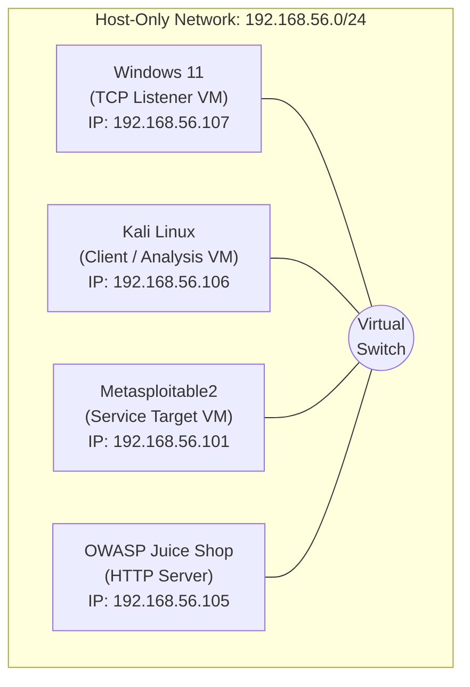
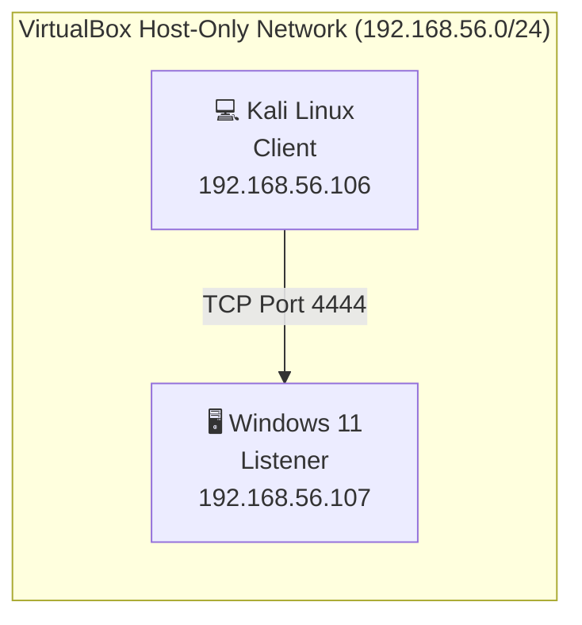
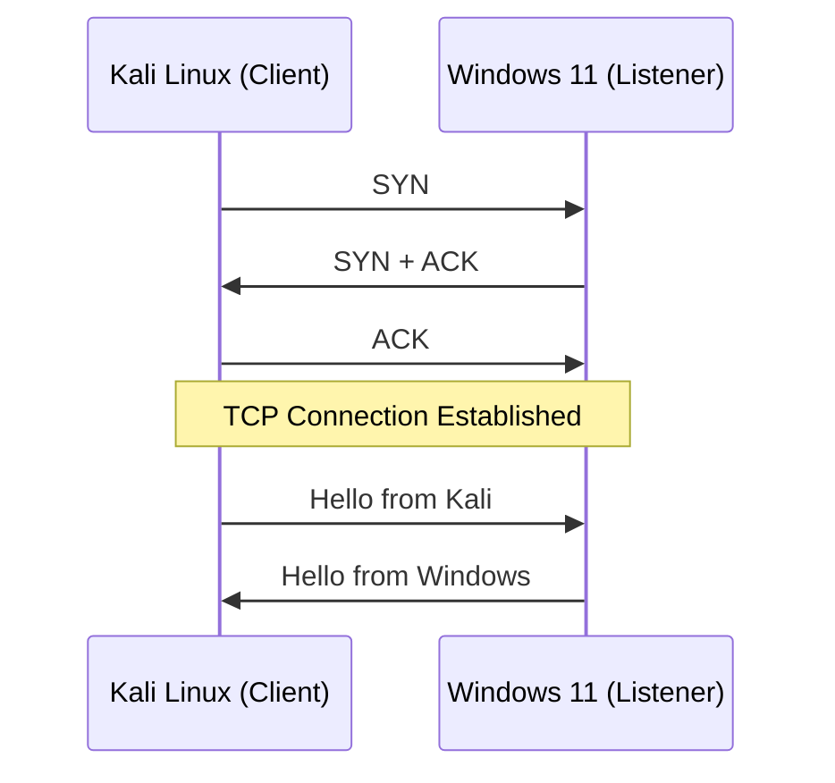
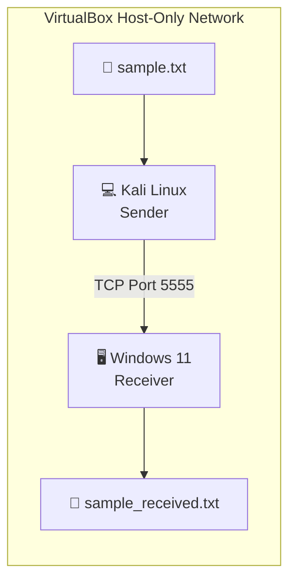

# Netcat (nc) Networking Lab – A Practical Guide to TCP Communication, Service Enumeration, and Network Troubleshooting

> A hands-on networking laboratory demonstrating the practical use of **Netcat (nc)** for TCP communication, file transfer, port scanning, banner grabbing, HTTP protocol testing, and network troubleshooting in a virtualized lab environment.


---

# Project Overview

Netcat (commonly known as **nc**) is one of the most versatile networking utilities available for Linux and Unix-like operating systems. Due to its flexibility in creating, reading, and writing TCP and UDP connections, it is widely recognized as the **"Swiss Army Knife of Networking."**

This project demonstrates the practical use of Netcat in a controlled virtual laboratory environment to understand how TCP communication works at the socket level. Rather than focusing on offensive techniques, the project emphasizes networking fundamentals, service verification, protocol analysis, and troubleshooting skills that are directly applicable to **Security Operations Center (SOC)**, **Blue Team**, **Network Administration**, and **IT Support** roles.

The laboratory exercises cover the complete workflow of establishing TCP connections, transferring files, verifying service availability, identifying network services through banner grabbing, manually interacting with HTTP servers, and troubleshooting connectivity issues using Netcat.

Each phase includes:

- Objective
- Theory
- Commands Executed
- Expected Output
- Actual Output
- Technical Explanation
- Troubleshooting Notes
- Screenshots
- Key Takeaways

---

# Objectives

The primary objectives of this project are to:

- Understand TCP client-server communication.
- Learn how Netcat creates TCP and UDP connections.
- Demonstrate manual file transfer over TCP.
- Perform service verification using Zero-I/O port scanning.
- Identify network services through banner grabbing.
- Manually construct and analyze HTTP requests.
- Develop practical troubleshooting techniques for common network connectivity issues.
- Document each exercise in a professional and reproducible manner suitable for technical portfolios.

---

# Skills Demonstrated

This project demonstrates practical experience with:

- TCP Socket Communication
- Client-Server Architecture
- File Transfer over TCP
- Zero-I/O Port Scanning
- Banner Grabbing
- Service Enumeration
- HTTP Request Construction
- HTTP Response Analysis
- Network Troubleshooting
- Connectivity Verification
- Basic Protocol Analysis
- Technical Documentation
- GitHub Project Documentation

---
## Table of Contents

- [Project Overview](#project-overview)
- [Objectives](#objectives)
- [Skills Demonstrated](#skills-demonstrated)
- [Lab Environment](#lab-environment)
- [Network Topology](#network-topology)
- [Repository Structure](#repository-structure)
- [Project Phases](#project-phases)
- [Screenshots](#screenshots)
- [Getting Started](#getting-started)
- [Learning Outcomes](#learning-outcomes)
- [References](#references)

---

# Lab Environment

The laboratory was built using a virtualized environment to simulate real-world network communication between multiple systems. Each virtual machine was assigned a specific role to demonstrate practical networking concepts using Netcat.

| Component | Version / Platform | Purpose |
|------------|--------------------|---------|
| Host Operating System | Kali Linux  | Runs Oracle VirtualBox and hosts all virtual machines |
| Oracle VirtualBox | 7.2.12r174389 | Virtualization platform |
| Kali Linux VM | Kali Linux 2026.3 | Primary attacker/client machine used for executing Netcat commands |
| Windows 11 VM | Windows 11 | Listener (server) and client for TCP communication |
| Metasploitable2 | Ubuntu-based Vulnerable VM | Target machine for banner grabbing and service enumeration |
| OWASP Juice Shop | Ubuntu 24.04 | HTTP server used for manual HTTP request testing |
| Netcat | OpenBSD Netcat / Ncat | Networking utility used throughout the project |

---

# Network Topology

The virtual machines communicate using a **Host-Only Network Adapter**, providing an isolated environment for laboratory testing without exposing services to external networks.


> **Note:** The IP addresses shown above reflect the lab environment used during this project. Your environment may use different addresses depending on your VirtualBox network configuration.

---

# Repository Structure

The repository is organized to provide a clear separation between documentation, screenshots, and supporting assets used throughout the laboratory exercises.

```text
netcat-networking-lab/
│
├── README.md                          # Complete project documentation
├── LICENSE                            # MIT License
├── .gitignore                         # Git ignore rules
│
├── screenshots/
│   ├── phase-1-tcp-chat/
│   ├── phase-2-file-transfer/
│   ├── phase-3-port-scanning/
│   ├── phase-4-banner-grabbing/
│   ├── phase-5-http-testing/
│   └── phase-6-network-troubleshooting/
│
└── assets/
    ├── network-topology.png
    ├── tcp-three-way-handshake.png
    └── osi-model-reference.png
```

### Repository Contents

| Item | Description |
|------|-------------|
| **README.md** | Contains the complete project documentation, including theory, lab setup, commands, screenshots, technical explanations, troubleshooting, and conclusions. |
| **LICENSE** | Defines the licensing terms for this project. |
| **.gitignore** | Specifies files and directories that Git should ignore. |
| **screenshots/** | Contains screenshots captured during each phase of the laboratory exercises. |
| **assets/** | Stores diagrams, network topology illustrations, and reference images used throughout the documentation. |

> **Note:** All documentation for this project is intentionally maintained within a single `README.md` file to provide a seamless reading experience. This allows readers to follow the complete lab from start to finish without navigating between multiple documents.

---

# Project Phases

The project is divided into six practical phases, each focusing on a different networking concept.

| Phase | Topic | Skills Demonstrated |
|------:|-------|---------------------|
| 1 | TCP Client-Server Communication | TCP sockets, listeners, clients |
| 2 | File Transfer Using Netcat | File transmission over TCP |
| 3 | Zero-I/O Port Scanning | Service discovery and port verification |
| 4 | Banner Grabbing & Service Enumeration | Protocol identification and service validation |
| 5 | HTTP Request Testing | Manual HTTP communication and response analysis |

| 6 | Network Troubleshooting | Connectivity verification and TCP communication analysis |

---

# Understanding Netcat

Before diving into the hands-on exercises, it is important to understand what **Netcat** is, how it works, and why it is considered one of the most versatile networking utilities available.

## What is Netcat?

**Netcat (nc)** is a lightweight command-line networking utility capable of reading from and writing to network connections using the **Transmission Control Protocol (TCP)** and the **User Datagram Protocol (UDP)**. It allows users to establish direct communication between two systems, making it an invaluable tool for network administrators, security professionals, penetration testers, and developers.

Originally developed by **Hobbit** in 1995, Netcat has become a standard networking utility available on most Linux distributions and is also included with **Nmap** as **Ncat** on Windows.

Unlike traditional networking tools that are designed for a single purpose, Netcat provides multiple networking capabilities through a single executable.

---

## Why is Netcat Called the "Swiss Army Knife of Networking"?

Netcat has earned the nickname **"Swiss Army Knife of Networking"** because a single tool can perform many different networking tasks.

Some of its most common capabilities include:

- Establishing TCP client-server communication
- Transferring files between systems
- Creating TCP and UDP listeners
- Performing basic port scanning
- Verifying service availability
- Banner grabbing and service identification
- Testing HTTP, FTP, SMTP, and other application protocols
- Network troubleshooting and connectivity testing
- Debugging network applications

Rather than installing multiple utilities for each networking task, Netcat provides these capabilities through simple command-line options.

---

## How Netcat Works

Netcat operates at the **Transport Layer (Layer 4)** of the OSI model by creating raw TCP or UDP socket connections.

Depending on how it is executed, Netcat can operate in two modes:

### Client Mode

In client mode, Netcat initiates a connection to a remote host and port.

```
Client (Kali Linux)
        │
        │ TCP Connection Request
        ▼
Server (Windows 11)
```

Example:

```bash
nc 192.168.56.107 4444
```

---

### Listener Mode

In listener mode, Netcat waits for incoming connections from remote systems.

```
Windows 11
Listening on Port 4444
        ▲
        │
Incoming TCP Connection
        │
Kali Linux
```

Example:

```bash
nc -l 4444
```

Once a client connects, both systems can exchange data over the established TCP session.

---

## TCP vs UDP

Netcat supports communication using both TCP and UDP protocols.

| Feature | TCP | UDP |
|----------|-----|-----|
| Connection-Oriented | ✅ Yes | ❌ No |
| Reliable Delivery | ✅ Yes | ❌ No |
| Packet Ordering | ✅ Guaranteed | ❌ Not Guaranteed |
| Error Checking | ✅ Yes | Limited |
| Typical Use Cases | SSH, HTTP, FTP | DNS, DHCP, VoIP, Streaming |

Throughout this project, all exercises use **TCP** because it provides reliable communication and is commonly used by enterprise services.

---

## Common Netcat Options

The following options are used throughout this laboratory.

| Option | Description |
|---------|-------------|
| `-l` | Listen for incoming connections |
| `-v` | Enable verbose output |
| `-z` | Zero-I/O mode (used for port scanning) |
| `-u` | Use UDP instead of TCP |
| `-p` | Specify the local source port |
| `-w` | Set a connection timeout |

---

## Lab Objectives

The practical exercises in this repository are designed to demonstrate how Netcat can be used for common networking tasks in a controlled laboratory environment.

By completing this project, you will learn how to:

- Establish TCP client-server communication.
- Transfer files over a TCP connection.
- Verify service availability using Zero-I/O scanning.
- Identify running services through banner grabbing.
- Manually interact with HTTP servers.
- Troubleshoot TCP connectivity issues.
- Understand how applications communicate over the network.

---
---

# Hands-on Laboratory Exercises

This section documents the practical implementation of Netcat within a controlled virtual laboratory environment. Each phase builds upon the previous one, gradually introducing new networking concepts while reinforcing core TCP communication principles.

Every exercise follows a consistent structure to ensure clarity, reproducibility, and ease of understanding.

Each phase includes:

- **Objective** – The purpose of the exercise.
- **Background Theory** – Fundamental networking concepts related to the activity.
- **Lab Environment** – Virtual machines and services used.
- **Commands Executed** – Complete commands used during the exercise.
- **Command Explanation** – Detailed explanation of each command and its parameters.
- **Expected Results** – The anticipated output before execution.
- **Actual Results** – The observed output captured during the lab.
- **Technical Analysis** – Explanation of what occurred at the protocol and application levels.
- **Screenshots** – Visual evidence of successful execution.
- **Troubleshooting** – Issues encountered and the steps taken to resolve them.
- **Key Takeaways** – Important concepts learned during the exercise.

The laboratory was performed in an isolated VirtualBox Host-Only network using Kali Linux, Windows 11, Metasploitable2, and OWASP Juice Shop. All commands, outputs, and screenshots presented in this repository were generated during the execution of this lab.

---

# Phase 1 – TCP Client-Server Communication

## Objective

The objective of this exercise is to establish a basic **Transmission Control Protocol (TCP)** client-server connection using **Netcat**. This exercise demonstrates how a TCP listener accepts incoming connections and how a client initiates communication with the listener. It also provides a practical understanding of socket-based communication, bidirectional data exchange, and the TCP connection lifecycle.

---

## Background Theory

TCP is a **connection-oriented** transport layer protocol that provides reliable communication between two hosts. Before any data is exchanged, TCP establishes a connection using the **Three-Way Handshake**:

1. **SYN** – The client requests to establish a connection.
2. **SYN-ACK** – The server acknowledges the request.
3. **ACK** – The client confirms the acknowledgment.

Once the handshake is complete, both systems can exchange data until either side terminates the connection.

In this exercise:

- **Windows 11** acts as the **TCP Server (Listener)**.
- **Kali Linux** acts as the **TCP Client**.

---

## Lab Environment

| Component | Details |
|----------|---------|
| Protocol | TCP |
| Port | 4444 |
| Listener | Windows 11 Virtual Machine |
| Client | Kali Linux Virtual Machine |
| Tool | Netcat (Ncat on Windows, nc on Kali) |
| Network | VirtualBox Host-Only Network |

---

# Phase 1 – TCP Client-Server Communication

**Objective:** Establish a reliable TCP client-server connection using Netcat to understand socket communication, connection establishment, and bidirectional data exchange.

---

## Quick Summary

| Category | Details |
|----------|---------|
| **Objective** | Establish a TCP client-server connection using Netcat |
| **Protocol** | TCP |
| **Port** | 4444 |
| **Client Machine** | Kali Linux |
| **Listener Machine** | Windows 11 |
| **Tool** | Netcat (nc / Ncat) |
| **Network** | VirtualBox Host-Only Adapter |
| **Estimated Time** | 10–15 Minutes |
| **Difficulty** | Beginner |

---

## Background Theory

The **Transmission Control Protocol (TCP)** is a **connection-oriented** protocol that provides reliable communication between two hosts. Before any application data is transmitted, TCP establishes a connection using the **Three-Way Handshake**, ensuring both systems are ready to communicate.

In this exercise:

- **Windows 11** acts as the **TCP Listener (Server)**.
- **Kali Linux** acts as the **TCP Client**.
- Communication occurs over a VirtualBox **Host-Only Network**, providing an isolated and controlled lab environment.

---

## Network Communication Flow

The following diagram illustrates the communication path between the client and the listener.



---

## TCP Three-Way Handshake

Before any data can be exchanged, TCP establishes a reliable connection using the three-way handshake.



---

# Exercise 1.1 – Configure the TCP Listener (Windows 11)

Launch **PowerShell** on the Windows 11 virtual machine and start Netcat in listening mode.

## Command

```powershell
ncat -l 4444
```

### Command Breakdown

| Parameter | Description |
|-----------|-------------|
| `ncat` | Launches the Netcat utility |
| `-l` | Enables Listener Mode |
| `4444` | TCP port used to accept incoming connections |

### Expected Output

```text
PS C:\Users\vboxuser> ncat -l 4444
```

The listener waits silently until a client initiates a connection.

### Evidence

**Figure 1.1 – Windows 11 waiting for incoming TCP connections**

> `screenshots/phase-1/01-listener-started.png`

---

# Exercise 1.2 – Establish the Client Connection (Kali Linux)

From the Kali Linux virtual machine, initiate a TCP connection to the Windows listener.

## Command

```bash
nc -v 192.168.56.107 4444
```

> Replace the IP address if your Windows VM uses a different address.

### Command Breakdown

| Parameter | Description |
|-----------|-------------|
| `nc` | Launches Netcat |
| `-v` | Enables verbose mode |
| `192.168.56.107` | Windows Listener IP Address |
| `4444` | Destination TCP Port |

### Expected Output

```text
Connection to 192.168.56.107 4444 port [tcp/*] succeeded!
```

This confirms:

- The listener is operational.
- The TCP three-way handshake completed successfully.
- A bidirectional communication channel has been established.

### Evidence

**Figure 1.2 – Kali Linux successfully connected to the Windows listener**

> `screenshots/phase-1/02-client-connected.png`

---

# Exercise 1.3 – Verify Bidirectional Communication

After the connection is established, both systems can exchange text messages over the active TCP session.

### Example Communication

After the TCP connection was successfully established, messages were exchanged between the client and the listener to verify bidirectional communication.

**Message sent from Kali Linux (Client):**

```text
Hello Windows!
```

**Message sent from Windows 11 (Listener):**

```text
Hello Kali
```

The successful exchange of messages confirms that:

- The TCP session was established successfully.
- Both systems were able to send and receive data over the same connection.
- Netcat provided full-duplex communication, allowing interactive data exchange between the client and the listener.

### Evidence

**Figure 1.3 – Successful bidirectional communication between Kali Linux and Windows 11**

> `screenshots/phase-1/03-message-exchange.png`
---

## Verification Checklist

The exercise is considered successful when the following conditions are met:

- ✅ Windows entered listening mode successfully.
- ✅ Kali Linux established a TCP connection.
- ✅ The TCP handshake completed successfully.
- ✅ Messages were exchanged in both directions.
- ✅ No connection errors or packet loss were observed.

---

## Technical Analysis

When the client executes:

```bash
nc -v 192.168.56.107 4444
```

the operating system creates a TCP socket and sends a **SYN** packet to the Windows listener. The listener responds with a **SYN-ACK**, indicating that it is ready to establish a connection. Finally, the Kali client replies with an **ACK**, completing the TCP three-way handshake.

Once the connection is established, Netcat redirects the standard input (`stdin`) and standard output (`stdout`) streams through the TCP socket. This allows both systems to exchange data interactively over a reliable transport-layer connection.

TCP ensures:

- Reliable data delivery
- Ordered packet transmission
- Error detection and recovery
- Connection state management

These characteristics make TCP the preferred protocol for services such as SSH, HTTP, FTP, SMTP, and database communication.

---

## Security Perspective

Understanding TCP communication is fundamental for cybersecurity professionals.

SOC analysts routinely investigate TCP sessions while analyzing:

- Unauthorized remote access attempts
- Suspicious outbound connections
- Malware Command-and-Control (C2) traffic
- Lateral movement within enterprise networks
- Firewall and IDS/IPS alerts
- Network service availability issues

A solid understanding of TCP communication enables analysts to interpret packet captures, firewall logs, SIEM events, and network alerts more effectively.

---

## Real-World Applications

The concepts demonstrated in this exercise are directly applicable to enterprise networking environments.

Examples include:

- Remote administration using SSH
- Web communication through HTTP and HTTPS
- Secure file transfers using FTP and SFTP
- Email delivery using SMTP
- Database client-server communication
- Internal application communication
- Network troubleshooting and diagnostics

---

## Troubleshooting

| Issue | Possible Cause | Resolution |
|--------|----------------|------------|
| Connection refused | Listener is not running | Start the Netcat listener before connecting. |
| Connection timed out | Firewall or incorrect IP address | Verify firewall rules and confirm the destination IP address. |
| Host unreachable | Network connectivity issue | Confirm both VMs are connected to the same Host-Only network. |
| Incorrect port | Listener configured on a different port | Ensure the client and listener use the same TCP port. |

---

## Key Takeaways

- Established a reliable TCP client-server connection using Netcat.
- Understood how TCP sockets enable communication between hosts.
- Observed the TCP Three-Way Handshake in a practical scenario.
- Successfully exchanged bidirectional messages over a TCP session.
- Learned how Netcat functions as both a TCP client and a TCP listener.
- Connected networking theory with real-world enterprise communication workflows.
- Built a strong foundation for subsequent Netcat exercises, including file transfer, port scanning, service enumeration, and protocol testing.

---
# Phase 2 – File Transfer Using Netcat

> **Objective:** Transfer a file between two virtual machines using Netcat over a TCP connection and verify its integrity using SHA-256 hashing.

---

## Quick Summary

| Category | Details |
|----------|---------|
| **Objective** | Transfer a file over TCP using Netcat |
| **Protocol** | TCP |
| **Port** | 5555 |
| **Sender** | Kali Linux |
| **Receiver** | Windows 11 |
| **Tool** | Netcat (nc / Ncat) |
| **Verification** | SHA-256 Hash Comparison |
| **Difficulty** | Beginner |
| **Estimated Time** | 15 Minutes |

---

## Background Theory

Netcat can transfer files by streaming raw bytes over an established TCP connection. Unlike protocols such as FTP or SFTP, Netcat does not implement authentication, encryption, compression, or integrity verification. Instead, it simply transmits data from the sender's standard input (`stdin`) to the receiver's standard output (`stdout`).

In this exercise:

- **Kali Linux** acts as the **Sender**.
- **Windows 11** acts as the **Receiver**.
- File integrity is verified using **SHA-256** after the transfer.

---

## File Transfer Workflow

```text
sample.txt
     │
     ▼
Standard Input (stdin)
     │
     ▼
Netcat (Sender)
     │
 TCP Stream
     │
     ▼
Netcat (Receiver)
     │
     ▼
Standard Output (stdout)
     │
     ▼
sample_received.txt
```

---

## Network Communication Flow



---

# Exercise 2.1 – Create the Sample File

Create a dedicated working directory and generate the file that will be transferred.

## Commands

```bash
mkdir -p ~/netcat-lab

cd ~/netcat-lab

cat > sample.txt << EOF
Netcat File Transfer Lab
Author: ShadowCipher

This file demonstrates TCP file transfer using Netcat.

EOF
```

### Verify the File

```bash
cat sample.txt
```

### Expected Output

```text
Netcat File Transfer Lab
Author: ShadowCipher

This file demonstrates TCP file transfer using Netcat.
```

### Evidence

**Figure 2.1 – Sample file created on Kali Linux**

> `screenshots/phase-2/01-create-sample-file.png`

---

# Exercise 2.2 – Configure the Receiver

On Windows 11, navigate to the working directory and start Netcat in listening mode.

## Commands

```powershell
cd ForLab

ncat -l 5555 > sample_received.txt
```

### Command Breakdown

| Command | Description |
|---------|-------------|
| `cd ForLab` | Navigate to the working directory |
| `ncat -l 5555` | Start Netcat in listening mode |
| `>` | Redirect received data into a file |

The listener will wait silently until the sender connects.

### Evidence

**Figure 2.2 – Windows waiting to receive the file**

> `screenshots/phase-2/02-listener.png`

---

# Exercise 2.3 – Transfer the File

From Kali Linux, send the contents of `sample.txt` to the Windows listener.

## Command

```bash
nc 192.168.56.102 5555 < sample.txt
```

### Command Breakdown

| Parameter | Description |
|-----------|-------------|
| `nc` | Launch Netcat |
| `192.168.56.102` | Windows 11 IP Address |
| `5555` | Destination TCP Port |
| `< sample.txt` | Redirect file contents into the TCP connection |

After the transfer completes, Netcat automatically closes the connection.

### Evidence

**Figure 2.3 – File successfully transmitted**

> `screenshots/phase-2/03-file-transfer.png`

---

# Exercise 2.4 – Verify the Received File

Display the received file on Windows.

## Command

```powershell
type sample_received.txt
```

### Expected Output

```text
Netcat File Transfer Lab
Author: ShadowCipher

This file demonstrates TCP file transfer using Netcat.
```

### Evidence

**Figure 2.4 – File successfully received**

> `screenshots/phase-2/04-received-file.png`

---

# Exercise 2.5 – Verify File Integrity

To ensure that the transferred file was not modified during transmission, compare the SHA-256 hash values on both systems.

## Kali Linux

```bash
sha256sum sample.txt
```

## Windows 11

```powershell
certutil -hashfile sample_received.txt SHA256
```

### Verification

The SHA-256 hashes generated on both systems should be identical.

Matching hash values confirm:

- The transfer completed successfully.
- No data corruption occurred.
- File integrity was preserved throughout transmission.

### Evidence

**Figure 2.5 – SHA-256 hash verification**

> `screenshots/phase-2/05-sha256-verification.png`

---

## Technical Analysis

During this exercise, Netcat established a reliable TCP connection between Kali Linux and Windows 11.

Instead of transmitting keyboard input, the contents of `sample.txt` were redirected from the sender's standard input (`stdin`) into the TCP socket. On the receiving side, Netcat redirected the incoming byte stream from its standard output (`stdout`) into `sample_received.txt`.

This demonstrates that Netcat transfers data as a continuous stream of bytes without interpreting file formats or metadata. As a result, the same technique can be used to transfer text files, configuration files, scripts, logs, or binary data.

To verify that the transfer completed successfully without corruption, SHA-256 hashes were generated on both systems. Matching hash values confirmed that the received file was identical to the original.

---

## Security Perspective

While Netcat is effective for demonstrating raw TCP file transfers, it does **not** provide:

- Authentication
- Encryption
- Integrity protection during transmission
- Access control

In enterprise environments, secure alternatives such as **SCP**, **SFTP**, **HTTPS**, or **SMB with encryption** should be used when transferring sensitive information.

Understanding how Netcat performs raw file transfers helps SOC analysts recognize legitimate administrative activity as well as identify suspicious data transfers during incident investigations.

---

## Real-World Applications

This technique can be used for:

- Network troubleshooting
- Testing TCP connectivity
- Transferring log files in isolated environments
- Demonstrating stream-based communication
- Validating firewall configurations
- Understanding data flow over TCP

---

## Troubleshooting

| Issue | Possible Cause | Resolution |
|--------|----------------|------------|
| Connection refused | Listener not started | Start the Windows listener before sending the file. |
| Empty output file | Sender command interrupted | Repeat the transfer. |
| Hash mismatch | File modified or incomplete transfer | Re-transfer the file and verify both hashes again. |
| Incorrect destination | Wrong IP address or port | Confirm the receiver's IP address and listening port. |

---

## Key Takeaways

- Successfully transferred a file using a raw TCP connection.
- Understood how shell redirection (`<` and `>`) works with Netcat.
- Learned how Netcat streams raw bytes without interpreting file contents.
- Verified successful transmission using SHA-256 hash comparison.
- Reinforced the reliability of TCP for file transfer.
- Gained practical experience with one of Netcat's most common networking use cases.

---
