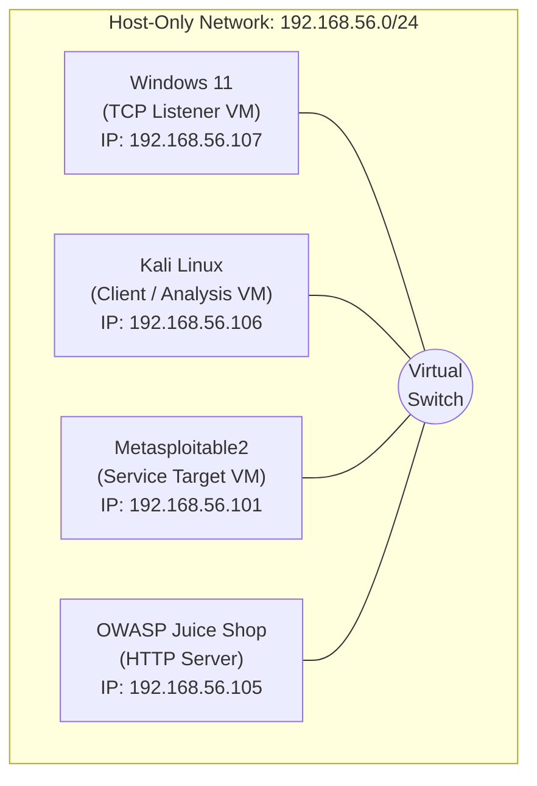

# Netcat (nc) Networking Lab – A Practical Guide to TCP Communication, Service Enumeration, and Network Troubleshooting

> A hands-on networking laboratory demonstrating the practical use of **Netcat (nc)** for TCP communication, file transfer, port scanning, banner grabbing, HTTP protocol testing, and network troubleshooting in a virtualized lab environment.


---

# Project Overview

Netcat (commonly known as **nc**) is one of the most versatile networking utilities available for Linux and Unix-like operating systems. Due to its flexibility in creating, reading, and writing TCP and UDP connections, it is widely recognized as the **"Swiss Army Knife of Networking."**

This project demonstrates the practical use of Netcat in a controlled virtual laboratory environment to understand how TCP communication works at the socket level. Rather than focusing on offensive techniques, the project emphasizes networking fundamentals, service verification, protocol analysis, and troubleshooting skills that are directly applicable to **Security Operations Center (SOC)**, **Blue Team**, **Network Administration**, and **IT Support** roles.

The laboratory exercises cover the complete workflow of establishing TCP connections, transferring files, verifying service availability, identifying network services through banner grabbing, manually interacting with HTTP servers, and troubleshooting connectivity issues using Netcat.

Each phase includes:

- Objective
- Theory
- Commands Executed
- Expected Output
- Actual Output
- Technical Explanation
- Troubleshooting Notes
- Screenshots
- Key Takeaways

---

# Objectives

The primary objectives of this project are to:

- Understand TCP client-server communication.
- Learn how Netcat creates TCP and UDP connections.
- Demonstrate manual file transfer over TCP.
- Perform service verification using Zero-I/O port scanning.
- Identify network services through banner grabbing.
- Manually construct and analyze HTTP requests.
- Develop practical troubleshooting techniques for common network connectivity issues.
- Document each exercise in a professional and reproducible manner suitable for technical portfolios.

---

# Skills Demonstrated

This project demonstrates practical experience with:

- TCP Socket Communication
- Client-Server Architecture
- File Transfer over TCP
- Zero-I/O Port Scanning
- Banner Grabbing
- Service Enumeration
- HTTP Request Construction
- HTTP Response Analysis
- Network Troubleshooting
- Connectivity Verification
- Basic Protocol Analysis
- Technical Documentation
- GitHub Project Documentation

---
## Table of Contents

- [Project Overview](#project-overview)
- [Objectives](#objectives)
- [Skills Demonstrated](#skills-demonstrated)
- [Lab Environment](#lab-environment)
- [Network Topology](#network-topology)
- [Repository Structure](#repository-structure)
- [Project Phases](#project-phases)
- [Screenshots](#screenshots)
- [Getting Started](#getting-started)
- [Learning Outcomes](#learning-outcomes)
- [References](#references)

---

# Lab Environment

The laboratory was built using a virtualized environment to simulate real-world network communication between multiple systems. Each virtual machine was assigned a specific role to demonstrate practical networking concepts using Netcat.

| Component | Version / Platform | Purpose |
|------------|--------------------|---------|
| Host Operating System | Kali Linux  | Runs Oracle VirtualBox and hosts all virtual machines |
| Oracle VirtualBox | 7.2.12r174389 | Virtualization platform |
| Kali Linux VM | Kali Linux 2026.3 | Primary attacker/client machine used for executing Netcat commands |
| Windows 11 VM | Windows 11 | Listener (server) and client for TCP communication |
| Metasploitable2 | Ubuntu-based Vulnerable VM | Target machine for banner grabbing and service enumeration |
| OWASP Juice Shop | Ubuntu 24.04 | HTTP server used for manual HTTP request testing |
| Netcat | OpenBSD Netcat / Ncat | Networking utility used throughout the project |

---

# Network Topology

The virtual machines communicate using a **Host-Only Network Adapter**, providing an isolated environment for laboratory testing without exposing services to external networks.


> **Note:** The IP addresses shown above reflect the lab environment used during this project. Your environment may use different addresses depending on your VirtualBox network configuration.

---

# Repository Structure

```text
netcat-networking-lab/
│
├── README.md
├── .gitignore
│
├── docs/
│   ├── 01-introduction.md
│   ├── 02-phase-1-tcp-chat.md
│   ├── 03-phase-2-file-transfer.md
│   ├── 04-phase-3-port-scanning.md
│   ├── 05-phase-4-banner-grabbing.md
│   ├── 06-phase-5-http-testing.md
│   ├── 07-phase-6-network-troubleshooting.md
│   └── 08-conclusion.md
│
├── screenshots/
│   ├── phase-1/
│   ├── phase-2/
│   ├── phase-3/
│   ├── phase-4/
│   ├── phase-5/
│   └── phase-6/
```

---

# Project Phases

The project is divided into six practical phases, each focusing on a different networking concept.

| Phase | Topic | Skills Demonstrated |
|------:|-------|---------------------|
| 1 | TCP Client-Server Communication | TCP sockets, listeners, clients |
| 2 | File Transfer Using Netcat | File transmission over TCP |
| 3 | Zero-I/O Port Scanning | Service discovery and port verification |
| 4 | Banner Grabbing & Service Enumeration | Protocol identification and service validation |
| 5 | HTTP Request Testing | Manual HTTP communication and response analysis |

Each phase includes:

- Objective
- Background Theory
- Lab Setup
- Commands Executed
- Command Explanation
- Expected Results
- Actual Results
- Technical Analysis
- Troubleshooting Notes
- Screenshots
- Key Takeaways

---
