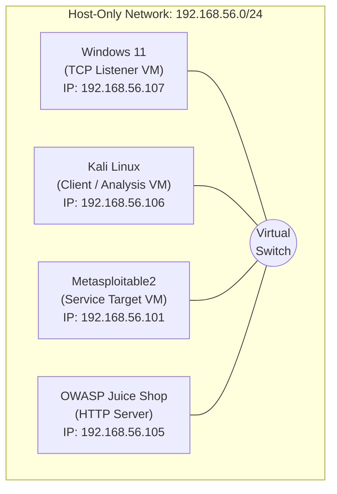
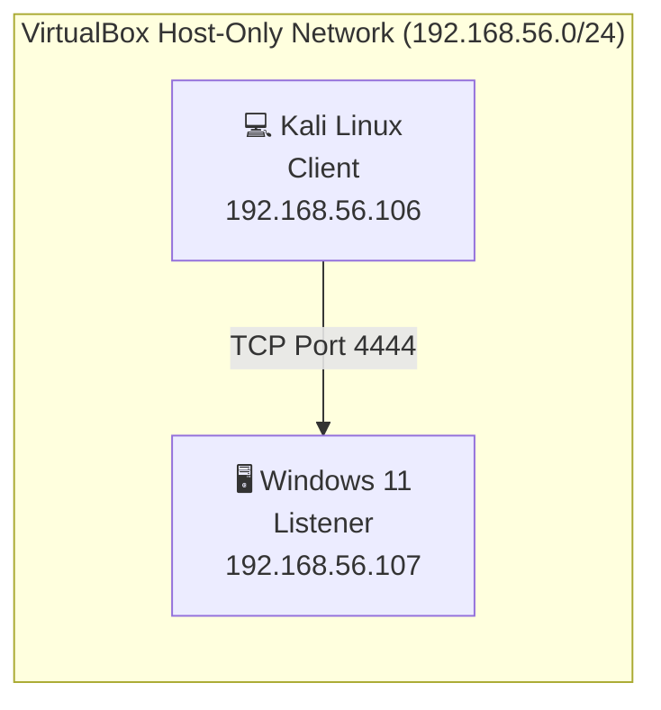
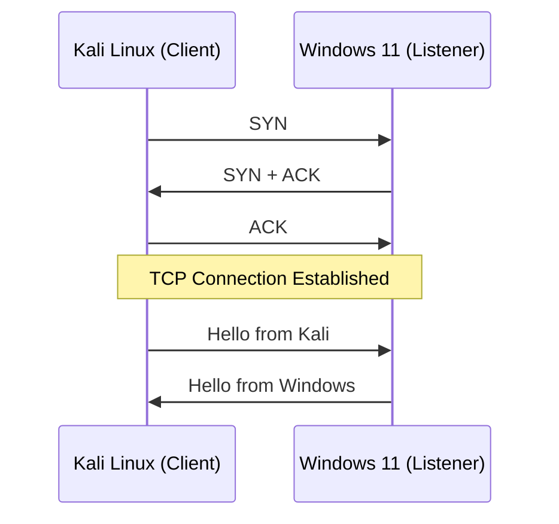
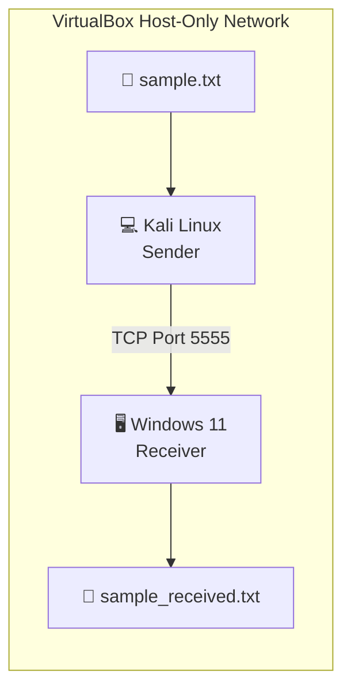
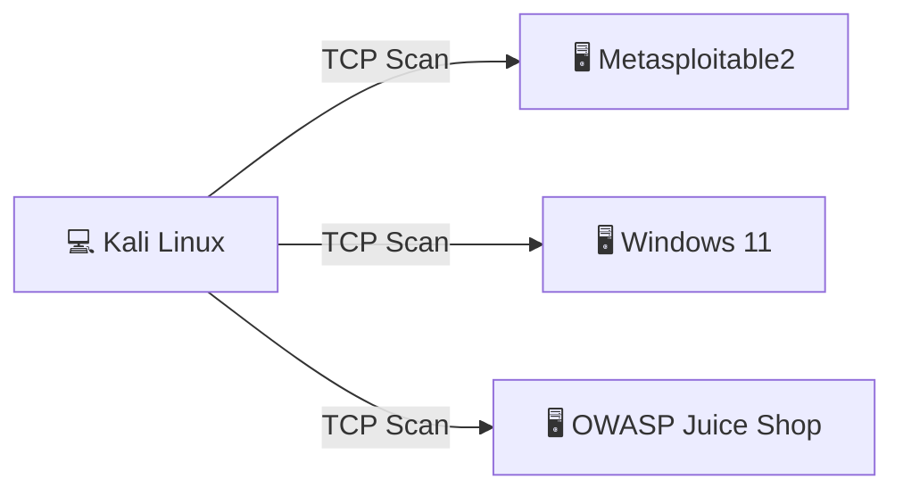
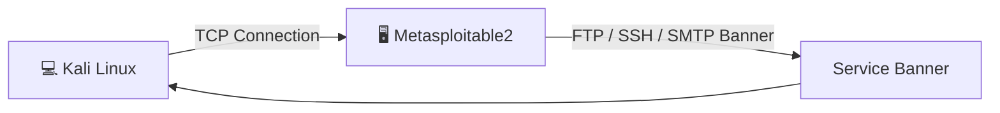
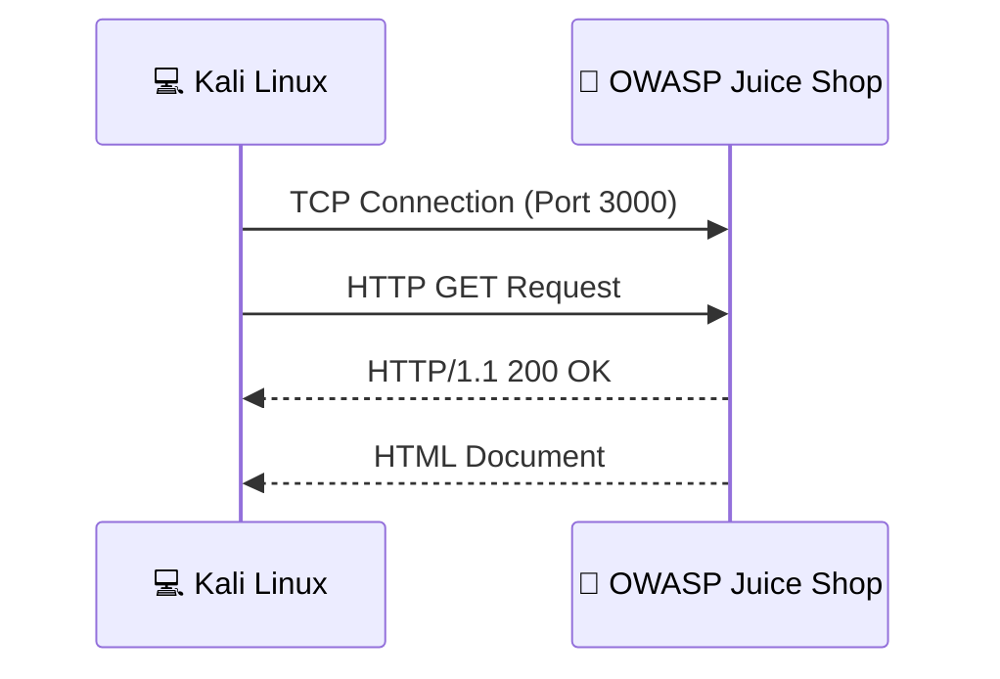

# Netcat (nc) Networking Lab – A Practical Guide to TCP Communication, Service Enumeration, and Network Troubleshooting

> A hands-on networking laboratory demonstrating the practical use of **Netcat (nc)** for TCP communication, file transfer, port scanning, banner grabbing, HTTP protocol testing, and network troubleshooting in a virtualized lab environment.


---

# Project Overview

Netcat (or **nc**) is one of the most useful command-line networking tools on Linux and Unix-like systems. It can create, read, and write to TCP and UDP connections, which is why it's often called the **"Swiss Army Knife of Networking."**

This project is a hands-on lab where I used Netcat inside a virtual environment to understand how TCP communication actually works at the socket level. The focus here isn't offensive hacking — it's the core networking skills that matter for **SOC**, **Blue Team**, **Network Administration**, and **IT Support** roles: setting up connections, checking if a service is running, reading protocol responses, and troubleshooting when something doesn't work.

The lab walks through the full workflow: making TCP connections, sending a file over the network, checking which services are up, grabbing banners to identify them, talking to a web server by hand, and troubleshooting connection issues along the way.

Each phase includes:

- Objective
- Theory
- Commands Executed
- Expected Output
- Actual Output
- Technical Explanation
- Troubleshooting Notes
- Screenshots
- Key Takeaways

---

# Objectives

The goals of this project were to:

- Understand TCP client-server communication.
- Learn how Netcat creates TCP and UDP connections.
- Demonstrate manual file transfer over TCP.
- Perform service verification using Zero-I/O port scanning.
- Identify network services through banner grabbing.
- Manually construct and analyze HTTP requests.
- Develop practical troubleshooting techniques for common network connectivity issues.
- Document each exercise in a professional and reproducible manner suitable for technical portfolios.

---

# Skills Demonstrated

This project demonstrates practical experience with:

- TCP Socket Communication
- Client-Server Architecture
- File Transfer over TCP
- Zero-I/O Port Scanning
- Banner Grabbing
- Service Enumeration
- HTTP Request Construction
- HTTP Response Analysis
- Network Troubleshooting
- Connectivity Verification
- Basic Protocol Analysis
- Technical Documentation
- GitHub Project Documentation

---
## Table of Contents

- [Project Overview](#project-overview)
- [Objectives](#objectives)
- [Skills Demonstrated](#skills-demonstrated)
- [Lab Environment](#lab-environment)
- [Network Topology](#network-topology)
- [Repository Structure](#repository-structure)
- [Project Phases](#project-phases)
- [Understanding Netcat](#understanding-netcat)
- [Hands-on Laboratory Exercises](#hands-on-laboratory-exercises)
  - [Phase 1 – TCP Client-Server Communication](#phase-1--tcp-client-server-communication)
  - [Phase 2 – File Transfer Using Netcat](#phase-2--file-transfer-using-netcat)
  - [Phase 3 – Zero-I/O Port Scanning Using Netcat](#phase-3--zero-io-port-scanning-using-netcat)
  - [Phase 4 – Banner Grabbing & Service Enumeration](#phase-4--banner-grabbing--service-enumeration)
  - [Phase 5 – HTTP Request Testing Using Netcat](#phase-5--http-request-testing-using-netcat)
- [Project Summary](#project-summary)
- [Technical Skills Demonstrated](#technical-skills-demonstrated)
- [Key Learning Outcomes](#key-learning-outcomes)
- [Challenges Encountered and Solutions](#challenges-encountered-and-solutions)
- [Practical Applications](#practical-applications)
- [Future Enhancements](#future-enhancements)
- [References](#references)
- [Conclusion](#conclusion)
- [Acknowledgements](#acknowledgements)
---

# Lab Environment

The laboratory was built using a virtualized environment to simulate real-world network communication between multiple systems. Each virtual machine was assigned a specific role to demonstrate practical networking concepts using Netcat.

| Component | Version / Platform | Purpose |
|------------|--------------------|---------|
| Host Operating System | Kali Linux  | Runs Oracle VirtualBox and hosts all virtual machines |
| Oracle VirtualBox | 7.2.12r174389 | Virtualization platform |
| Kali Linux VM | Kali Linux 2026.3 | Primary attacker/client machine used for executing Netcat commands |
| Windows 11 VM | Windows 11 | Listener (server) and client for TCP communication |
| Metasploitable2 | Ubuntu-based Vulnerable VM | Target machine for banner grabbing and service enumeration |
| OWASP Juice Shop | Ubuntu 24.04 | HTTP server used for manual HTTP request testing |
| Netcat | OpenBSD Netcat / Ncat | Networking utility used throughout the project |

---

# Network Topology

The virtual machines communicate using a **Host-Only Network Adapter**, providing an isolated environment for laboratory testing without exposing services to external networks.


> **Note:** The IP addresses shown above reflect the lab environment used during this project. Your environment may use different addresses depending on your VirtualBox network configuration.

---

# Repository Structure

The repository is organized to provide a clear separation between documentation, screenshots, and supporting assets used throughout the laboratory exercises.

```text
netcat-networking-lab/
│
├── README.md                          # Complete project documentation
├── LICENSE                            # Project license
├── .gitignore                         # Git ignore rules
│
├── screenshots/
│   ├── phase-1-tcp-chat/
│   ├── phase-2-file-transfer/
│   ├── phase-3-port-scanning/
│   ├── phase-4-banner-grabbing/
│   └── phase-5-http-testing/
```

### Repository Contents

| Item | Description |
|------|-------------|
| **README.md** | Contains the complete project documentation, including theory, lab setup, commands, screenshots, technical explanations, troubleshooting, and conclusions. |
| **.gitignore** | Specifies files and directories that Git should ignore. |
| **screenshots/** | Contains screenshots captured during each phase of the laboratory exercises. |

> **Note:** All documentation for this project is intentionally maintained within a single `README.md` file to provide a seamless reading experience. This allows readers to follow the complete lab from start to finish without navigating between multiple documents.

---

# Project Phases

The project is divided into five practical phases, each focusing on a different networking concept.

| Phase | Topic | Skills Demonstrated |
|------:|-------|---------------------|
| 1 | TCP Client-Server Communication | TCP sockets, listeners, clients |
| 2 | File Transfer Using Netcat | File transmission over TCP |
| 3 | Zero-I/O Port Scanning | Service discovery and port verification |
| 4 | Banner Grabbing & Service Enumeration | Protocol identification and service validation |
| 5 | HTTP Request Testing | Manual HTTP communication and response analysis |

---

# Understanding Netcat

Before jumping into the exercises, here's a quick rundown of what Netcat actually is and why it's worth learning.

## What is Netcat?

**Netcat (nc)** is a small command-line tool that reads from and writes to network connections using **TCP** and **UDP**. In plain terms, it lets two machines talk directly to each other over the network, which makes it genuinely useful for network admins, security folks, pentesters, and developers alike.

It was originally written by **Hobbit** back in 1995, and it's stuck around ever since — most Linux distros ship it by default, and on Windows it comes bundled with **Nmap** as **Ncat**.

Most networking tools are built to do one job. Netcat isn't — it packs a bunch of networking capabilities into one small executable.

---

## Why is Netcat Called the "Swiss Army Knife of Networking"?

It gets that nickname because one small tool can do so many different jobs. A few examples:

- Establishing TCP client-server communication
- Transferring files between systems
- Creating TCP and UDP listeners
- Performing basic port scanning
- Verifying service availability
- Banner grabbing and service identification
- Testing HTTP, FTP, SMTP, and other application protocols
- Network troubleshooting and connectivity testing
- Debugging network applications

Instead of reaching for a different tool for each task, you get all of this through a handful of command-line flags.

---

## How Netcat Works

Netcat works at the **Transport Layer (Layer 4)** of the OSI model — it opens raw TCP or UDP socket connections directly.

It runs in one of two modes, depending on how you start it:

### Client Mode

In client mode, Netcat reaches out and connects to a remote host and port.

```
Client (Kali Linux)
        │
        │ TCP Connection Request
        ▼
Server (Windows 11)
```

Example:

```bash
nc 192.168.56.107 4444
```

---

### Listener Mode

In listener mode, Netcat sits and waits for other systems to connect to it.

```
Windows 11
Listening on Port 4444
        ▲
        │
Incoming TCP Connection
        │
Kali Linux
```

Example:

```bash
nc -l 4444
```

Once a client connects, both systems can exchange data over the established TCP session.

---

## TCP vs UDP

Netcat can talk over both TCP and UDP. Here's how they compare:

| Feature | TCP | UDP |
|----------|-----|-----|
| Connection-Oriented | ✅ Yes | ❌ No |
| Reliable Delivery | ✅ Yes | ❌ No |
| Packet Ordering | ✅ Guaranteed | ❌ Not Guaranteed |
| Error Checking | ✅ Yes | Limited |
| Typical Use Cases | SSH, HTTP, FTP | DNS, DHCP, VoIP, Streaming |

All the exercises in this project use **TCP**, since it's reliable and it's what most real-world services (SSH, HTTP, FTP, etc.) actually run on.

---

## Common Netcat Options

Here are the flags used throughout this lab.

| Option | Description |
|---------|-------------|
| `-l` | Listen for incoming connections |
| `-v` | Enable verbose output |
| `-z` | Zero-I/O mode (used for port scanning) |
| `-u` | Use UDP instead of TCP |
| `-p` | Specify the local source port |
| `-w` | Set a connection timeout |

---

With the basics out of the way, here's the hands-on part.

---

# Hands-on Laboratory Exercises

This section walks through each exercise as it was actually performed in the lab. Every phase builds on the one before it, so the concepts stack up as you go.

Each exercise follows the same layout, so it's easy to follow along:

- **Objective** – The purpose of the exercise.
- **Background Theory** – Fundamental networking concepts related to the activity.
- **Lab Environment** – Virtual machines and services used.
- **Commands Executed** – Complete commands used during the exercise.
- **Command Explanation** – Detailed explanation of each command and its parameters.
- **Expected Results** – The anticipated output before execution.
- **Actual Results** – The observed output captured during the lab.
- **Technical Analysis** – Explanation of what occurred at the protocol and application levels.
- **Screenshots** – Visual evidence of successful execution.
- **Troubleshooting** – Issues encountered and the steps taken to resolve them.
- **Key Takeaways** – Important concepts learned during the exercise.

Everything below was run in an isolated VirtualBox Host-Only network using Kali Linux, Windows 11, Metasploitable2, and OWASP Juice Shop. All commands, outputs, and screenshots are from this lab.

---

# Phase 1 – TCP Client-Server Communication

**Objective:** Establish a reliable TCP client-server connection using Netcat to understand socket communication, connection establishment, and bidirectional data exchange.

---

## Quick Summary

| Category | Details |
|----------|---------|
| **Objective** | Establish a TCP client-server connection using Netcat |
| **Protocol** | TCP |
| **Port** | 4444 |
| **Client Machine** | Kali Linux |
| **Listener Machine** | Windows 11 |
| **Tool** | Netcat (nc / Ncat) |
| **Network** | VirtualBox Host-Only Adapter |
| **Estimated Time** | 10–15 Minutes |
| **Difficulty** | Beginner |

---

## Background Theory

The **Transmission Control Protocol (TCP)** is a **connection-oriented** protocol that provides reliable communication between two hosts. Before any application data is transmitted, TCP establishes a connection using the **Three-Way Handshake**, ensuring both systems are ready to communicate.

In this exercise:

- **Windows 11** acts as the **TCP Listener (Server)**.
- **Kali Linux** acts as the **TCP Client**.
- Communication occurs over a VirtualBox **Host-Only Network**, providing an isolated and controlled lab environment.

---

## Network Communication Flow

The following diagram illustrates the communication path between the client and the listener.



---

## TCP Three-Way Handshake

Before any data can be exchanged, TCP establishes a reliable connection using the three-way handshake.



---

# Exercise 1.1 – Configure the TCP Listener (Windows 11)

Launch **PowerShell** on the Windows 11 virtual machine and start Netcat in listening mode.

## Command

```powershell
ncat -l 4444
```

### Command Breakdown

| Parameter | Description |
|-----------|-------------|
| `ncat` | Launches the Netcat utility |
| `-l` | Enables Listener Mode |
| `4444` | TCP port used to accept incoming connections |

### Expected Output

```text
PS C:\Users\vboxuser> ncat -l 4444
```

The listener waits silently until a client initiates a connection.

### Evidence

**Figure 1.1 – Windows 11 waiting for incoming TCP connections**

> [Screenshot](screenshots/phase-1/01-listener-started.png)

---

# Exercise 1.2 – Establish the Client Connection (Kali Linux)

From the Kali Linux virtual machine, initiate a TCP connection to the Windows listener.

## Command

```bash
nc 192.168.56.107 4444
```

> Replace the IP address if your Windows VM uses a different address.

### Command Breakdown

| Parameter | Description |
|-----------|-------------|
| `nc` | Launches Netcat |
| `-v` | Enables verbose mode |
| `192.168.56.107` | Windows Listener IP Address |
| `4444` | Destination TCP Port |

### Expected Output

```text
Connection to 192.168.56.107 4444 port [tcp/*] succeeded!
```

This confirms:

- The listener is operational.
- The TCP three-way handshake completed successfully.
- A bidirectional communication channel has been established.

### Evidence

**Figure 1.2 – Kali Linux successfully connected to the Windows listener**

> [Screenshot](screenshots/phase-1/02-client-connected.png)

---

# Exercise 1.3 – Verify Bidirectional Communication

After the connection is established, both systems can exchange text messages over the active TCP session.

### Example Communication

After the TCP connection was successfully established, messages were exchanged between the client and the listener to verify bidirectional communication.

**Message sent from Kali Linux (Client):**

```text
Hello Windows!
```

**Message sent from Windows 11 (Listener):**

```text
Hello Kali
```

The successful exchange of messages confirms that:

- The TCP session was established successfully.
- Both systems were able to send and receive data over the same connection.
- Netcat provided full-duplex communication, allowing interactive data exchange between the client and the listener.

### Evidence

**Figure 1.3 – Successful bidirectional communication between Kali Linux and Windows 11**

> [Screenshot](screenshots/phase-1/03-message-exchange.png)
---

## Verification Checklist

The exercise is considered successful when the following conditions are met:

- ✅ Windows entered listening mode successfully.
- ✅ Kali Linux established a TCP connection.
- ✅ The TCP handshake completed successfully.
- ✅ Messages were exchanged in both directions.
- ✅ No connection errors or packet loss were observed.

---

## Technical Analysis

When the client executes:

```bash
nc -v 192.168.56.107 4444
```

the OS opens a TCP socket and sends a **SYN** packet to the Windows listener. The listener replies with **SYN-ACK** to say it's ready, and the Kali client sends back an **ACK** — that's the three-way handshake done.

Once that connection is up, Netcat just pipes standard input (`stdin`) and standard output (`stdout`) through the socket. That's why typing on one side shows up on the other — you're literally typing into the TCP stream.

TCP takes care of:

- Reliable data delivery
- Ordered packet transmission
- Error detection and recovery
- Connection state management

That's why it's the protocol behind SSH, HTTP, FTP, SMTP, and most database connections.

---

## Security Perspective

This is exactly the kind of thing SOC analysts look at all day — TCP sessions show up constantly when investigating:

- Unauthorized remote access attempts
- Suspicious outbound connections
- Malware Command-and-Control (C2) traffic
- Lateral movement within enterprise networks
- Firewall and IDS/IPS alerts
- Network service availability issues

Knowing how a TCP handshake actually looks makes it a lot easier to read packet captures, firewall logs, and SIEM alerts and understand what's really going on.

---

## Real-World Applications

The same connection pattern shows up everywhere in enterprise networking:

- Remote administration using SSH
- Web communication through HTTP and HTTPS
- Secure file transfers using FTP and SFTP
- Email delivery using SMTP
- Database client-server communication
- Internal application communication
- Network troubleshooting and diagnostics

---

## Troubleshooting

| Issue | Possible Cause | Resolution |
|--------|----------------|------------|
| Connection refused | Listener is not running | Start the Netcat listener before connecting. |
| Connection timed out | Firewall or incorrect IP address | Verify firewall rules and confirm the destination IP address. |
| Host unreachable | Network connectivity issue | Confirm both VMs are connected to the same Host-Only network. |
| Incorrect port | Listener configured on a different port | Ensure the client and listener use the same TCP port. |

---

## Key Takeaways

- Set up a working TCP connection between two machines using Netcat.
- Saw the TCP three-way handshake happen in practice, not just on a diagram.
- Exchanged messages both ways over the same connection.
- Used Netcat as both a client and a listener.
- Built the foundation this whole lab is based on — the next phases all build on this connection.

---

# Phase 2 – File Transfer Using Netcat   

**Objective:** Transfer a file between two virtual machines using Netcat over a TCP connection and verify its integrity using SHA-256 hashing.

---

## Quick Summary

| Category | Details |
|----------|---------|
| **Objective** | Transfer a file over TCP using Netcat |
| **Protocol** | TCP |
| **Port** | 5555 |
| **Sender** | Kali Linux |
| **Receiver** | Windows 11 |
| **Tool** | Netcat (nc / Ncat) |
| **Verification** | SHA-256 Hash Comparison |
| **Difficulty** | Beginner |
| **Estimated Time** | 15 Minutes |

---

## Background Theory

Netcat can transfer files by streaming raw bytes over an established TCP connection. Unlike protocols such as FTP or SFTP, Netcat does not implement authentication, encryption, compression, or integrity verification. Instead, it simply transmits data from the sender's standard input (`stdin`) to the receiver's standard output (`stdout`).

In this exercise:

- **Kali Linux** acts as the **Sender**.
- **Windows 11** acts as the **Receiver**.
- File integrity is verified using **SHA-256** after the transfer.

---

## File Transfer Workflow

```text
sample.txt
     │
     ▼
Standard Input (stdin)
     │
     ▼
Netcat (Sender)
     │
 TCP Stream
     │
     ▼
Netcat (Receiver)
     │
     ▼
Standard Output (stdout)
     │
     ▼
sample_received.txt
```

---

## Network Communication Flow



---

# Exercise 2.1 – Create the Sample File

Create a dedicated working directory and generate the file that will be transferred.

## Commands

```bash
mkdir -p ~/netcat-lab

cd ~/netcat-lab

cat > sample.txt << EOF
Netcat File Transfer Lab
Author: ShadowCipher

This file demonstrates TCP file transfer using Netcat.

EOF
```

### Verify the File

```bash
cat sample.txt
```

### Expected Output

```text
Netcat File Transfer Lab
Author: ShadowCipher

This file demonstrates TCP file transfer using Netcat.
```

### Evidence

**Figure 2.1 – Sample file created on Kali Linux**

> [Screenshot](screenshots/phase-2/01-create-sample-file.png)

---

# Exercise 2.2 – Configure the Receiver

On Windows 11, navigate to the working directory and start Netcat in listening mode.

## Commands

```powershell
cd ForLab

ncat -l 5555 > sample_received.txt
```

### Command Breakdown

| Command | Description |
|---------|-------------|
| `cd ForLab` | Navigate to the working directory |
| `ncat -l 5555` | Start Netcat in listening mode |
| `>` | Redirect received data into a file |

The listener will wait silently until the sender connects.

### Evidence

**Figure 2.2 – Windows waiting to receive the file**

> [Screenshot](screenshots/phase-2/02-listener.png)

---

# Exercise 2.3 – Transfer the File

From Kali Linux, send the contents of `sample.txt` to the Windows listener.

## Command

```bash
nc 192.168.56.102 5555 < sample.txt
```

### Command Breakdown

| Parameter | Description |
|-----------|-------------|
| `nc` | Launch Netcat |
| `192.168.56.102` | Windows 11 IP Address |
| `5555` | Destination TCP Port |
| `< sample.txt` | Redirect file contents into the TCP connection |

After the transfer completes, Netcat automatically closes the connection.

### Evidence

**Figure 2.3 – File successfully transmitted**

> [Screenshot](screenshots/phase-2/03-file-transfer.png)

---

# Exercise 2.4 – Verify the Received File

Display the received file on Windows.

## Command

```powershell
type sample_received.txt
```

### Expected Output

```text
Netcat File Transfer Lab
Author: ShadowCipher

This file demonstrates TCP file transfer using Netcat.
```

### Evidence

**Figure 2.4 – File successfully received**

> [Screenshot](screenshots/phase-2/04-received-file.png)

---

# Exercise 2.5 – Verify File Integrity

To ensure that the transferred file was not modified during transmission, compare the SHA-256 hash values on both systems.

## Kali Linux

```bash
sha256sum sample.txt
```

## Windows 11

```powershell
certutil -hashfile sample_received.txt SHA256
```

### Verification

The SHA-256 hashes generated on both systems should be identical.

Matching hash values confirm:

- The transfer completed successfully.
- No data corruption occurred.
- File integrity was preserved throughout transmission.

### Evidence

**Figure 2.5 – SHA-256 hash verification**

> [Screenshot](screenshots/phase-2/05-sha256-verification.png)

---

## Technical Analysis

This exercise uses the same TCP connection idea from Phase 1, just with a file instead of typed messages.

Instead of feeding keyboard input into the connection, `sample.txt` was redirected from `stdin` straight into the TCP socket on the sender's side. On the receiving end, Netcat took the incoming bytes from `stdout` and wrote them into `sample_received.txt`.

This is the key thing to understand about Netcat: it doesn't care what kind of file it's moving. It just streams raw bytes. That means the same trick works for text files, configs, scripts, logs, or binaries — Netcat has no idea what's inside, it just moves data.

To make sure nothing got corrupted along the way, SHA-256 hashes were generated on both sides. Matching hashes confirmed the file arrived exactly as it left.

---

## Security Perspective

It's worth being clear about what this method does **not** give you:

- Authentication
- Encryption
- Integrity protection during transmission
- Access control

For anything sensitive in a real environment, you'd want **SCP**, **SFTP**, **HTTPS**, or **SMB with encryption** instead.

Knowing what a raw, unauthenticated file transfer looks like is also useful on the defensive side — it helps you recognize normal admin activity versus something that looks like data being pulled off a network without authorization.

---

## Real-World Applications

This kind of raw transfer is useful for:

- Network troubleshooting
- Testing TCP connectivity
- Transferring log files in isolated environments
- Demonstrating stream-based communication
- Validating firewall configurations
- Understanding data flow over TCP

---

## Troubleshooting

| Issue | Possible Cause | Resolution |
|--------|----------------|------------|
| Connection refused | Listener not started | Start the Windows listener before sending the file. |
| Empty output file | Sender command interrupted | Repeat the transfer. |
| Hash mismatch | File modified or incomplete transfer | Re-transfer the file and verify both hashes again. |
| Incorrect destination | Wrong IP address or port | Confirm the receiver's IP address and listening port. |

---

## Key Takeaways

- Moved a file between two machines using nothing but a raw TCP connection.
- Learned how shell redirection (`<` and `>`) feeds data into and out of Netcat.
- Saw firsthand that Netcat just streams bytes — it doesn't care what's inside the file.
- Verified the transfer with SHA-256 hashes instead of just trusting it worked.

---

# Phase 3 – Zero-I/O Port Scanning Using Netcat

**Objective:** Discover open TCP ports on multiple systems using Netcat's Zero-I/O mode to identify available network services without establishing an interactive session.

---

## Quick Summary

| Category | Details |
|----------|---------|
| **Objective** | Discover open TCP ports using Netcat |
| **Technique** | Zero-I/O TCP Port Scanning |
| **Protocol** | TCP |
| **Mode** | Zero-I/O (`-z`) |
| **Verbosity** | Enabled (`-v`) |
| **Tool** | Netcat (nc) |
| **Difficulty** | Beginner |
| **Estimated Time** | 15–20 Minutes |

---

## Background Theory

Port scanning is the process of identifying open network ports on a remote system. Each open port generally represents a service waiting for client connections, such as SSH, FTP, HTTP, or SMB.

Netcat provides a lightweight method of checking whether a TCP port is open using **Zero-I/O Mode**.

Unlike interactive connections, Zero-I/O mode attempts to establish a TCP connection without transmitting application data. This allows administrators and security analysts to quickly verify service availability while generating minimal network traffic.

This exercise demonstrates service discovery across three different systems within the laboratory environment:

- **Metasploitable2**
- **Windows 11**
- **OWASP Juice Shop**

---

## Network Communication Flow



---

## Understanding Netcat Scan Options

| Option | Description |
|---------|-------------|
| `-z` | Enables Zero-I/O mode (no data is transmitted). |
| `-v` | Displays verbose output, including connection status. |

---

# Exercise 3.1 – Scan Metasploitable2

Scan a range of TCP ports to identify running services.

## Command

```bash
nc -zv 192.168.56.101 20-1000
```

### Purpose

This command scans TCP ports **20 through 1000** on the Metasploitable2 virtual machine.

### Open Ports Discovered

| Port | Service |
|------|----------|
| 21 | FTP |
| 22 | SSH |
| 23 | Telnet |
| 25 | SMTP |
| 53 | DNS |
| 80 | HTTP |
| 111 | RPCBind |
| 139 | NetBIOS |
| 445 | SMB |
| 512 | rexec |
| 513 | rlogin |
| 514 | rsh |

### Evidence

**Figure 3.1 – TCP port scan of Metasploitable2**

> [Screenshot](screenshots/phase-3/01-metasploitable-range-scan.png)

---

# Exercise 3.2 – Verify MySQL Service

Instead of scanning a range, verify whether a specific service is available.

## Command

```bash
nc -zv 192.168.56.101 3306
```

### Purpose

Checks whether the MySQL database service is accepting TCP connections.

### Expected Result

```text
(UNKNOWN) [192.168.56.101] 3306 (mysql) open
```

### Evidence

**Figure 3.2 – MySQL service verification**

> [Screenshot](screenshots/phase-3/02-mysql-port.png)

---

# Exercise 3.3 – Scan Windows 11 Services

Scan common Windows networking ports.

## Command

```bash
nc -zv 192.168.56.107 135-139
```

### Open Ports Discovered

| Port | Service |
|------|----------|
| 135 | Microsoft RPC Endpoint Mapper |
| 139 | NetBIOS Session Service |

These services are commonly used by Windows for remote administration and file sharing.

### Evidence

**Figure 3.3 – Windows service scan**

> [Screenshot](screenshots/phase-3/03-windows-range-scan.png)

---

# Exercise 3.4 – Verify SMB Service

Check whether the SMB service is available.

## Command

```bash
nc -zv 192.168.56.107 445
```

### Expected Result

```text
(UNKNOWN) [192.168.56.107] 445 (microsoft-ds) open
```

### Purpose

Port **445** hosts the Server Message Block (SMB) protocol, which is widely used for:

- File sharing
- Printer sharing
- Windows authentication
- Active Directory communication

### Evidence

**Figure 3.4 – SMB service verification**

> [Screenshot](screenshots/phase-3/04-smb-port.png)

---

# Exercise 3.5 – Verify OWASP Juice Shop

Check whether the Juice Shop web application is accepting TCP connections.

## Command

```bash
nc -zv 192.168.56.105 3000
```

### Expected Result

```text
(UNKNOWN) [192.168.56.105] 3000 open
```

### Purpose

Port **3000** hosts the OWASP Juice Shop web application.

The successful connection confirms that the HTTP service is running and ready for subsequent testing.

### Evidence

**Figure 3.5 – OWASP Juice Shop service verification**

> [Screenshot](screenshots/phase-3/05-juice-shop-port.png)

---

## Verification Checklist

The exercise was considered successful when:

- ✅ Open TCP ports were successfully identified.
- ✅ Multiple hosts were scanned.
- ✅ Individual services were verified.
- ✅ Netcat correctly reported open ports.
- ✅ Service availability was confirmed without exchanging application data.

---

## Technical Analysis

Netcat's **Zero-I/O Mode** (`-z`) tries to open a TCP connection without actually sending any data.

For each port it checks, Netcat sends a connection request. If something responds, the port is reported as **open**. If nothing's listening, or the connection gets refused, it's reported closed or unreachable.

It's a quick, low-noise way to check what's actually running on a system, without needing a full-blown scanner.

---

## Security Perspective

Port scanning is usually one of the first steps in both network administration and security work — you can't secure what you don't know is exposed.

For SOC analysts and defenders, it's used to:

- Verify exposed services
- Detect unauthorized network services
- Validate firewall configurations
- Confirm system hardening
- Troubleshoot application connectivity
- Inventory enterprise assets

Knowing exactly what's open on a system is the first step toward shrinking the attack surface and catching services that shouldn't be running at all.

---

## Real-World Applications

Zero-I/O scanning shows up in:

- Service availability verification
- Firewall validation
- Asset inventory
- Network troubleshooting
- Security assessments
- Baseline configuration verification

---

## Troubleshooting

| Issue | Possible Cause | Resolution |
|--------|----------------|------------|
| Connection refused | Service is not running | Verify the target service is active. |
| Host unreachable | Network connectivity issue | Confirm both systems are on the same network. |
| Timeout | Firewall blocking traffic | Review firewall rules and network ACLs. |
| Incorrect results | Wrong IP address or port range | Verify the target address and scan parameters. |

---

## Key Takeaways

- Used Netcat's Zero-I/O mode to check for open ports without a full interactive connection.
- Found live services across three different hosts (Metasploitable2, Windows 11, Juice Shop).
- Confirmed individual services on specific ports instead of just scanning wide ranges.
- Got more comfortable recognizing common ports and what services usually sit behind them.

---

# Phase 4 – Banner Grabbing & Service Enumeration

**Objective:** Identify running network services by connecting to open TCP ports and analyzing the service banners returned by the target systems.

---

## Quick Summary

| Category | Details |
|----------|---------|
| **Objective** | Identify network services through banner grabbing |
| **Technique** | Service Enumeration |
| **Protocol** | TCP |
| **Tool** | Netcat (nc) |
| **Target** | Metasploitable2 |
| **Difficulty** | Beginner |
| **Estimated Time** | 15 Minutes |

---

## Background Theory

Banner grabbing is the process of connecting to a network service and reading the information it provides immediately after a successful connection. Many services transmit a banner containing useful information such as:

- Service name
- Software version
- Protocol version
- Operating system information
- Vendor details

This information helps administrators verify service configurations and assists security professionals in identifying systems and validating network inventories.

Unlike vulnerability scanning, banner grabbing is a passive service identification technique that simply observes information voluntarily presented by the remote service.

---

## Service Enumeration Workflow



---

# Exercise 4.1 – Enumerate FTP Service

Connect to the FTP service running on Metasploitable2.

## Command

```bash
nc 192.168.56.101 21
```

### Expected Output

```text
220 (vsFTPd 2.3.4)
```

### Technical Explanation

The FTP server immediately returns its service banner after the TCP connection is established.

The banner identifies:

- Service: FTP
- Software: vsFTPd
- Version: 2.3.4

### Evidence

**Figure 4.1 – FTP banner returned by the server**

> [Screenshot](screenshots/phase-4/01-ftp-banner.png)

---

# Exercise 4.2 – Enumerate SSH Service

Connect to the SSH service.

## Command

```bash
nc 192.168.56.101 22
```

### Expected Output

```text
SSH-2.0-OpenSSH_4.7p1 Debian-8ubuntu1
```

### Technical Explanation

Unlike FTP, SSH immediately advertises its protocol version before authentication begins.

The banner provides:

- Protocol Version: SSH-2.0
- Software: OpenSSH
- Version: 4.7p1
- Platform: Debian

Your terminal may also display:

```text
Protocol mismatch.
```

This occurs because Netcat is not an SSH client. After reading the banner, it sends unexpected input, causing the SSH server to terminate the session. This behavior is expected and confirms that the SSH service is functioning correctly.

### Evidence

**Figure 4.2 – SSH banner returned by the server**

> [Screenshot](screenshots/phase-4/02-ssh-banner.png)

---

# Exercise 4.3 – Enumerate SMTP Service

Connect to the SMTP service.

## Command

```bash
nc 192.168.56.101 25
```

### Expected Output

```text
220 metasploitable.localdomain ESMTP Postfix (Ubuntu)
```

### Technical Explanation

SMTP servers transmit a greeting banner immediately after a client connects.

The returned banner identifies:

- Service: SMTP
- Mail Server: Postfix
- Operating System: Ubuntu

### Evidence

**Figure 4.3 – SMTP banner returned by the server**

> [Screenshot](screenshots/phase-4/03-smtp-banner.png)

---

## Verification Checklist

The exercise was considered successful when:

- ✅ FTP banner was successfully retrieved.
- ✅ SSH banner identified the protocol and software version.
- ✅ SMTP banner identified the mail server.
- ✅ Service versions matched the expected applications.
- ✅ All banners were obtained using simple TCP connections.

---

## Technical Analysis

Banner grabbing works because a lot of application-layer services just announce themselves the moment you connect — no login needed, they just tell you who they are.

Netcat is handy here because it's a plain TCP client — it can talk to any of these services without needing FTP, SSH, or SMTP-specific software.

The banners themselves are surprisingly informative: service type, software name, version number, and sometimes even the OS underneath. That's enough to confirm a service is configured correctly, verify it's running, or get a feel for what's on a box.

---

## Security Perspective

Banner grabbing shows up a lot in:

- Asset inventory
- Network troubleshooting
- Security assessments
- Vulnerability management
- Incident response
- Configuration validation

The flip side is that a banner is also free information for an attacker — an old, unpatched version number in a banner is basically an invitation. That's why a lot of production systems are configured to hide or minimize what their banners give away.

---

## Real-World Applications

Banner grabbing is a practical tool for:

- Identify active network services.
- Verify software versions.
- Confirm protocol implementations.
- Troubleshoot service availability.
- Validate configuration changes.
- Maintain accurate asset inventories.

---

## Troubleshooting

| Issue | Possible Cause | Resolution |
|--------|----------------|------------|
| Connection refused | Service is not running | Verify the target service is active. |
| No banner returned | Service does not disclose banners | Confirm using protocol-specific clients if necessary. |
| Protocol mismatch | Netcat is not a protocol-aware client | Expected behavior when connecting to services such as SSH. |
| Timeout | Firewall or connectivity issue | Verify network connectivity and firewall configuration. |

---

## Key Takeaways

- Pulled service banners straight off FTP, SSH, and SMTP with nothing but a plain TCP connection.
- Read banners to identify software names and version numbers.
- Understood why some services announce themselves right away and others don't.
- Saw firsthand why banner disclosure matters from a defensive standpoint.

---

# Phase 5 – HTTP Request Testing Using Netcat

**Objective:** Manually construct and transmit an HTTP request over a raw TCP connection using Netcat to understand the structure of the HTTP protocol and analyze the server's response.

---

## Quick Summary

| Category | Details |
|----------|---------|
| **Objective** | Test an HTTP service using a manually crafted HTTP request |
| **Protocol** | HTTP over TCP |
| **Target Service** | OWASP Juice Shop |
| **Target Port** | 3000 |
| **Tool** | Netcat (nc) |
| **Difficulty** | Intermediate |
| **Estimated Time** | 15–20 Minutes |

---

## Background Theory

Hypertext Transfer Protocol (HTTP) is an application-layer protocol that operates over TCP. Before a web browser renders a webpage, it sends a properly formatted HTTP request to the web server.

An HTTP/1.1 request consists of:

- A request line
- One or more headers
- A blank line indicating the end of the headers

If required headers are missing or the request format is invalid, the server returns an HTTP error response such as **400 Bad Request**.

This exercise demonstrates how to manually build and transmit an HTTP request using Netcat without relying on a browser or specialized HTTP client.

---

## HTTP Communication Flow



---

# Exercise 5.1 – Initial HTTP Request

Connect to the OWASP Juice Shop application.

## Command

```bash
nc 192.168.56.105 3000
```

After the TCP connection is established, attempt to send the HTTP request manually.

```http
GET / HTTP/1.1
```

### Actual Result

```text
HTTP/1.1 400 Bad Request
Connection: close
```

### Why Did This Happen?

HTTP/1.1 requires the **Host** header to identify the destination virtual host.

Because only the request line was transmitted, the web server detected an incomplete request and responded with:

```text
400 Bad Request
```

This behavior is expected and confirms that the server is correctly validating the HTTP request format.


---

# Exercise 5.2 – Construct a Valid HTTP Request

Instead of typing the request interactively, generate a complete HTTP request using `printf` and pipe it into Netcat.

## Command

```bash
printf "GET / HTTP/1.1\r\nHost: 192.168.56.105\r\nConnection: close\r\n\r\n" | nc 192.168.56.105 3000
```

### Command Breakdown

| Component | Description |
|-----------|-------------|
| `printf` | Constructs the HTTP request |
| `GET / HTTP/1.1` | Requests the root resource |
| `Host:` | Required header for HTTP/1.1 |
| `Connection: close` | Requests the server to close the connection after sending the response |
| `\r\n` | Carriage Return + Line Feed (HTTP line terminator) |
| `|` | Pipes the generated request into Netcat |
| `nc` | Sends the request through the TCP connection |

---

## Expected Response

```http
HTTP/1.1 200 OK
```

Followed by:

- HTTP headers
- HTML document
- JavaScript references
- CSS references

The response confirms that the web server successfully processed the request.

### Evidence

**Figure 5.2 – Successful HTTP response (200 OK) from OWASP Juice Shop**

> [Screenshot](screenshots/phase-5/01-http-200.png)

---

## Verification Checklist

The exercise was considered successful when:

- ✅ A TCP connection to the web server was established.
- ✅ An initial malformed request produced **400 Bad Request**.
- ✅ A correctly formatted HTTP request returned **200 OK**.
- ✅ HTTP headers were successfully displayed.
- ✅ The HTML source code of the application was received.

---

## Technical Analysis

The first attempt only sent the request line and skipped the `Host` header, which HTTP/1.1 requires. Without it, the server had no way to know which site it was being asked for, so it returned **400 Bad Request**.

The fixed version included everything HTTP/1.1 needs:

- Request line
- Host header
- Connection header
- A blank line to mark the end of the headers

Using `printf` mattered here because it let me control the exact line endings — HTTP requires **CRLF (`\r\n`)**, not a plain newline. Once the request was formatted correctly, the server responded with **HTTP/1.1 200 OK** and sent back the full HTML page for the Juice Shop app.

---

## Security Perspective

Being able to read and write raw HTTP is a genuinely useful skill, not just an academic exercise.

SOC analysts, pentesters, and web security folks deal with raw HTTP constantly when:

- Investigating web application attacks
- Analyzing proxy logs
- Troubleshooting API communication
- Validating HTTP headers
- Identifying malformed requests
- Reviewing packet captures

Building a request by hand — instead of always going through a browser — makes it much clearer what's actually happening at the protocol level.

---

## Real-World Applications

This comes in handy for:

- Testing web servers without a browser
- Understanding HTTP protocol structure
- Troubleshooting application connectivity
- Learning how browsers communicate with servers
- Verifying HTTP responses
- Debugging web applications

---

## Troubleshooting

| Issue | Possible Cause | Resolution |
|--------|----------------|------------|
| HTTP 400 Bad Request | Missing required HTTP headers | Include the `Host` header and terminate headers with a blank line. |
| No response | Incorrect IP address or port | Verify the target address and ensure the web application is running. |
| Connection refused | Service not running | Start the OWASP Juice Shop application before testing. |
| Incomplete response | Incorrect line endings | Use `\r\n` when constructing the HTTP request. |

---

## Key Takeaways

- Connected to a web server using nothing but Netcat and typed out an HTTP request by hand.
- Learned exactly what an HTTP/1.1 request needs to be valid.
- Saw why the `Host` header isn't optional, first through a 400 error and then by fixing it.
- Got a 200 OK back and could see the raw response headers and HTML.
- Came away with a much clearer picture of how TCP and HTTP actually connect.

---

# Project Summary

This project was about learning **Netcat (nc)** by actually using it — for communication, file transfer, service checks, and troubleshooting inside a controlled virtual lab.

Instead of relying on automated scanners or GUI tools, every exercise here was done directly from the command line. That approach forces you to actually understand what's happening at the protocol level instead of just clicking a button and reading a report.

The lab covers five phases, starting with basic TCP communication and working up to service discovery and manual HTTP requests. All of it ran inside a VirtualBox lab with Kali Linux, Windows 11, Metasploitable2, and OWASP Juice Shop — and every command, output, and screenshot in this repo came from actually running these exercises.

---

# Technical Skills Demonstrated

Here's a breakdown of the skills this project touches on:

### Networking Fundamentals

- TCP client-server communication
- TCP socket establishment and termination
- Understanding listeners and client connections
- Network connectivity verification
- Host-Only virtual networking

### Netcat Operations

- Creating TCP listeners
- Initiating client connections
- File transfer over raw TCP streams
- Zero-I/O TCP port scanning
- Service validation
- Banner grabbing
- Manual HTTP request generation
- Network troubleshooting

### Protocol Analysis

- TCP communication workflow
- File transmission over TCP
- HTTP request formatting
- HTTP response analysis
- Service identification through banners
- Common network ports and services

### Operating Systems

- Kali Linux
- Windows 11
- Linux Command Line
- Windows PowerShell

### Documentation

- Technical documentation
- Markdown authoring
- Professional GitHub project organization
- Screenshot-based laboratory reporting

---

# Key Learning Outcomes

This lab did a lot to sharpen my understanding of how network communication and protocols actually behave, not just in theory.

A few things that stuck with me the most:

- How TCP actually sets up a reliable connection between two hosts.
- How Netcat works as both a client and a listener.
- How to move a file over raw TCP and confirm it arrived intact using SHA-256.
- How to find live services with Zero-I/O scanning.
- How to identify what's running on a port just by reading its banner.
- How an HTTP request and response are actually structured.
- Why the `Host` header isn't optional in HTTP/1.1.
- How to troubleshoot connectivity issues instead of just guessing.
- More confidence working directly on the command line instead of leaning on GUI tools.

Honestly, the biggest takeaway is that these fundamentals matter. Before jumping into Nmap, Wireshark, SIEM platforms, or vulnerability scanners, it helps a lot to actually understand what's happening underneath them.

---

# Challenges Encountered and Solutions

No lab goes perfectly on the first try — here's what actually went wrong and how I fixed it.

| Challenge | Resolution |
|-----------|------------|
| Windows initially did not recognize the `ncat` command | Installed the official Nmap package, which includes Ncat. |
| ICMP ping requests from Kali to Windows failed | Verified that TCP communication worked correctly and confirmed Host-Only network connectivity. |
| Initial HTTP request returned **400 Bad Request** | Identified the missing `Host` header and corrected the request using `printf` with proper CRLF formatting. |
| Understanding why SSH returned `Protocol mismatch` | Learned that Netcat is not an SSH client and that the SSH server was correctly rejecting unexpected input after transmitting its banner. |
| Verifying file integrity after transfer | Compared SHA-256 hashes on both systems to confirm successful transmission without data corruption. |

These challenges provided valuable troubleshooting experience that closely resembles the investigative process required in real-world IT and cybersecurity environments.

---

# Practical Applications

Netcat is a small tool, but everything covered here maps directly to real work that network engineers, sysadmins, and security analysts do on a regular basis:

- Network troubleshooting
- Service availability verification
- Connectivity testing
- File transfer in isolated environments
- Network diagnostics
- Firewall validation
- Service enumeration
- Basic protocol analysis
- Security assessments
- Incident response investigations

Getting comfortable with these basics makes it a lot easier to work with the bigger enterprise networking and security tools later on.

---

# Future Enhancements

This is a solid starting point, not a finished product. Things I'd like to add down the line:

- UDP communication using Netcat
- IPv6 networking exercises
- Secure communication using Ncat's SSL/TLS capabilities
- Packet capture and protocol analysis with Wireshark
- Python socket programming examples
- Bash scripting to automate common networking tasks
- Firewall testing and rule validation
- Additional HTTP methods (POST, PUT, DELETE)
- Simple client-server applications
- Integration with SIEM and network monitoring platforms

---

# References

The following resources were used for research and technical verification throughout this project:

- Netcat (`nc`) Manual Pages
- Ncat User Guide (Nmap Project)
- RFC 793 – Transmission Control Protocol (TCP)
- RFC 9112 – HTTP/1.1
- OWASP Juice Shop Documentation
- Oracle VirtualBox Documentation
- Kali Linux Documentation

---

# Conclusion

This project was my hands-on way of learning Netcat inside a controlled virtual lab, and along the way it also reinforced a lot of core networking concepts that show up everywhere in IT and cybersecurity work.

Across five phases, I set up TCP client-server communication, transferred a file over the network, ran Zero-I/O port scans, pulled service banners, and manually built an HTTP request to talk to a web application directly.

The goal wasn't just to memorize commands. I wanted to understand **why** each one works, **how** TCP communication actually happens, and **what** information you can pull out of a service just by connecting to it.

Writing this documentation — commands, explanations, diagrams, screenshots, and the troubleshooting notes — was its own useful exercise. Being able to explain what you did and why is just as important as doing it, especially in cybersecurity roles where clear reporting matters.

Overall, this repo is less about Netcat itself and more about building the fundamentals: how to think through a network problem, test it methodically, and document it clearly. Those are the same skills that carry over into **Network Security**, **SOC**, **System Administration**, and **IT Infrastructure** work.

---

# Acknowledgements

This project is part of my personal journey to learn cybersecurity through hands-on practice rather than just theory.

Thanks to the open-source tools and projects that made this lab possible:

- Nmap / Ncat
- Kali Linux
- Oracle VirtualBox
- Metasploitable2
- OWASP Juice Shop

---

# Connect With Me

If you have feedback on this project or just want to connect, feel free to reach out:

- **GitHub:** [your-github-username](https://github.com/your-github-username)
- **LinkedIn:** [your-linkedin-profile](https://linkedin.com/in/your-linkedin-profile)
- **Email:** your.email@example.com

> Replace the placeholders above with your actual profile links before publishing.

---
